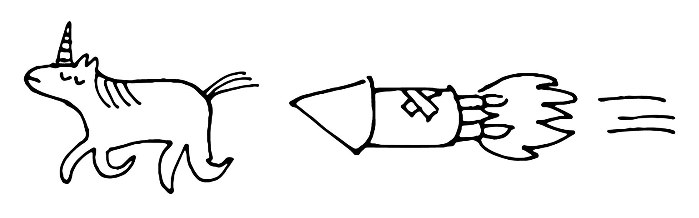

.. _index:

============================================================
Hunting Unicorns With Goblin Technology: A Quick Start Guide
============================================================

Unicorn-derived items consistently fetch some of the highest prices you’re likely to see for unprocessed animal goods at your local auction house. It’s no wonder, then, that many enterprising hunters seek to take advantage of this lucrative market opportunity.

Unfortunately, unicorns are both difficult to find and difficult to catch. And many of the ways to approach this problem require advanced skills or high equipment costs, making the unicorn trade mainly inaccessible to the casual hunter. Fortunately, however, there are some shortcuts you can take to make things easier.

In this quick start guide, we show you how (while often overlooked by humans) goblin technology can help. Goblin technology is one of the easiest and cheapest approaches to unicorn hunting. However, it is also one of the most dangerous.

.. rubric:: Table of contents

.. toctree::

   introduction
   preparation
   your-first-hunt
   next-steps
